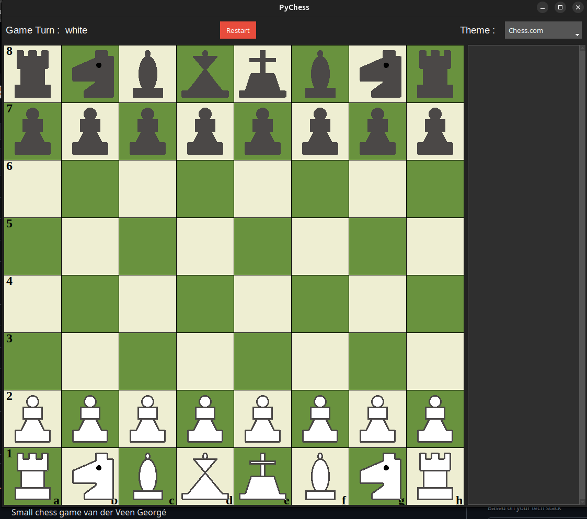
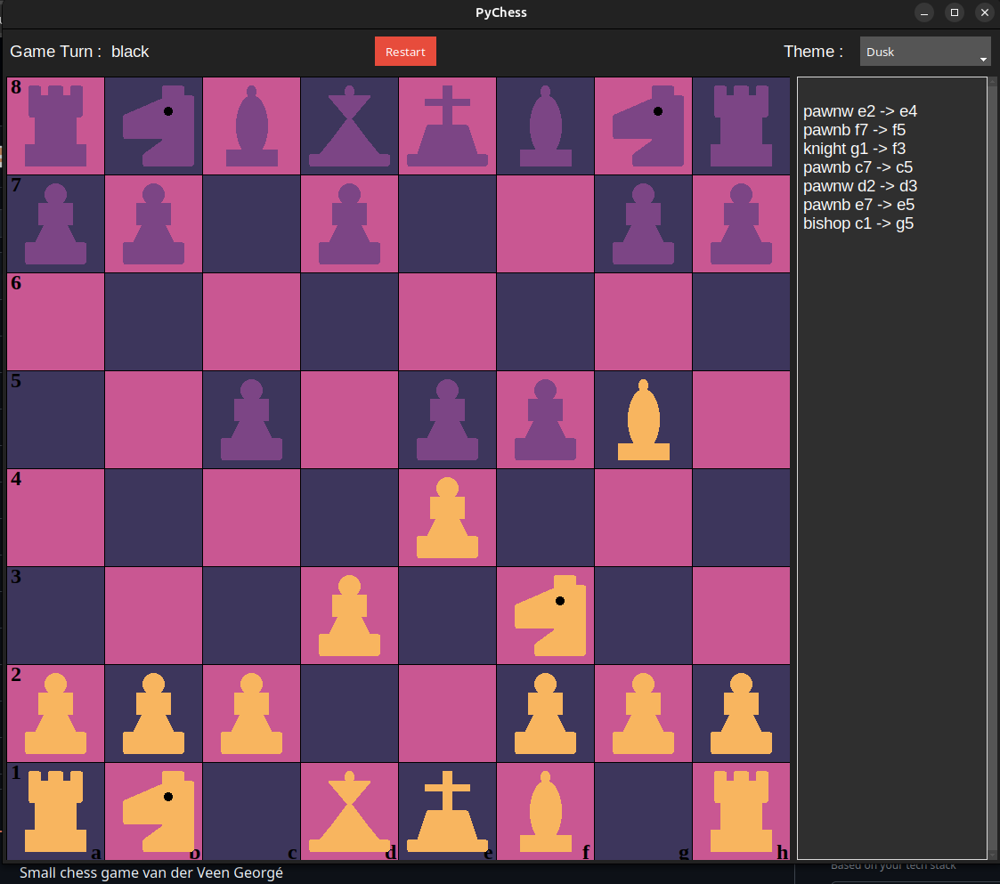

# PyChess

A two-player chess game for the desktop, written in Python with a Tkinter / ttkbootstrap interface.
The chess engine (move generation, check detection, special rules) is written from scratch, without any chess library, and is covered by a pytest test suite.

The project had one imposed constraint: **no classes**. The whole game is built with functions and plain data structures (lists, tuples, dictionaries) to represent the board, the pieces and the move history.



## Features

**Chess rules**
- Legal move generation for every piece, including pins: a move that would leave your own king in check is refused
- Check detection, with the attacking pieces highlighted on the board
- Castling (king side and queen side), only if neither the king nor the rook has moved and the squares are not attacked
- En passant
- Automatic pawn promotion to a queen
- End of game: checkmate, stalemate and draw by threefold repetition

**Interface**
- Click a piece to display its possible moves, then click the destination square
- Turn indicator and move history panel (`knight g1 -> f3`, …)
- Restart button with confirmation
- Several colour themes for the board, selectable from a dropdown menu; the choice is saved in `themes.json`
- The current game is saved in `board.json`, so it can be resumed after closing the window
- All pieces are drawn directly on the canvas (no image files)



## Project structure

| File | Role |
|---|---|
| `main.py` | Entry point |
| `engine.py` | Game logic: legal moves, check, checkmate, stalemate, castling, en passant, promotion, history |
| `gui.py` | Graphical interface (board, turn indicator, history, themes) |
| `pieces_draw.py` | Drawing of the pieces and move indicators on the canvas |
| `test_main.py` | Unit tests for the engine (pytest) |
| `board.json` | Starting position, current game and move history |
| `themes.json` | Board colour themes and the selected theme |

## Requirements

- Python 3.13 or higher
- [uv](https://docs.astral.sh/uv/) (recommended) or pip

## Installation and launch

```bash
git clone https://github.com/AlphaXZero/PyChess.git
cd PyChess
uv sync
uv run main.py
```

## Tests

The engine is tested with pytest: moves of each piece, captures, blocked pieces, pins, check by one or several pieces, checkmate, stalemate, castling conditions, en passant and promotion.

```bash
uv run pytest
```

With coverage report:

```bash
uv run pytest --cov
```

## Author

Georgé Van der Veen – developed as part of my studies at IFOSUP Wavre.